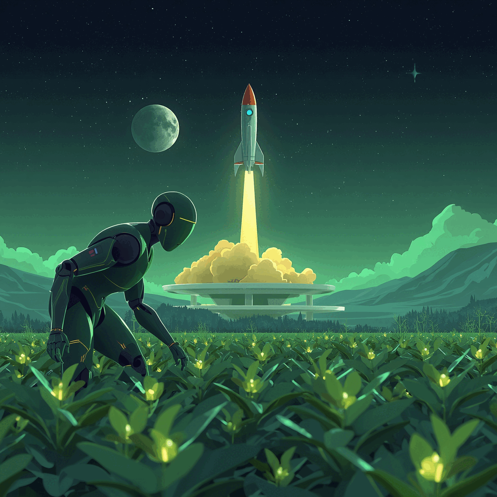

# 🚀 Phigold-Semesta
### "Satu Baris Kode, Sejuta Manfaat Bagi Semesta"

 

<picture>
  <source media="(prefers-color-scheme: dark)" srcset="https://raw.githubusercontent.com/Phigold-Semesta/Phigold-Semesta/output/github-contribution-grid-snake-dark.svg">
  <source media="(prefers-color-scheme: light)" srcset="https://raw.githubusercontent.com/Phigold-Semesta/Phigold-Semesta/output/github-contribution-grid-snake.svg">
  
</picture>

---

### 🌌 Philosophy of "Phigold-Semesta"
> **Phigold** diambil dari konstanta matematika **Golden Ratio ($\phi$)**. Sesuatu yang seringkali tidak terlihat secara kasat mata, namun menjadi standar estetika dan harmoni yang sempurna di alam semesta. Seperti itulah peran seorang programmer; bekerja di balik layar, mungkin tak terlihat jasanya, namun setiap baris kode yang ditulis memberikan dampak nyata yang luas. **Phigold-Semesta** adalah manifestasi dari pengabdian kode untuk manfaat yang tak terbatas bagi seluruh alam.

---

### 👤 About Me
- 🔭 **Current Project:** Building **SOWAN v2** (Digital Guest Book LPSE Karawang) with Laravel 12.
- 🌱 **Learning:** Deep Learning & Computer Vision for Agricultural Automation.
- ⚡ **Goal:** Integrating IoT into farming systems to boost productivity.
- 🌙 **Ambition:** Masters in AI at UGM & PhD at ETH Zurich.

---

### 🛠 Tech Stack

  
   
  

---

### 🧠 Inspiration & Foundations

  
  
  
  
  

---

### 📊 GitHub Journey

  
  

  

---

### 🌠 Future Vision: IoT Agriculture & Space

  

